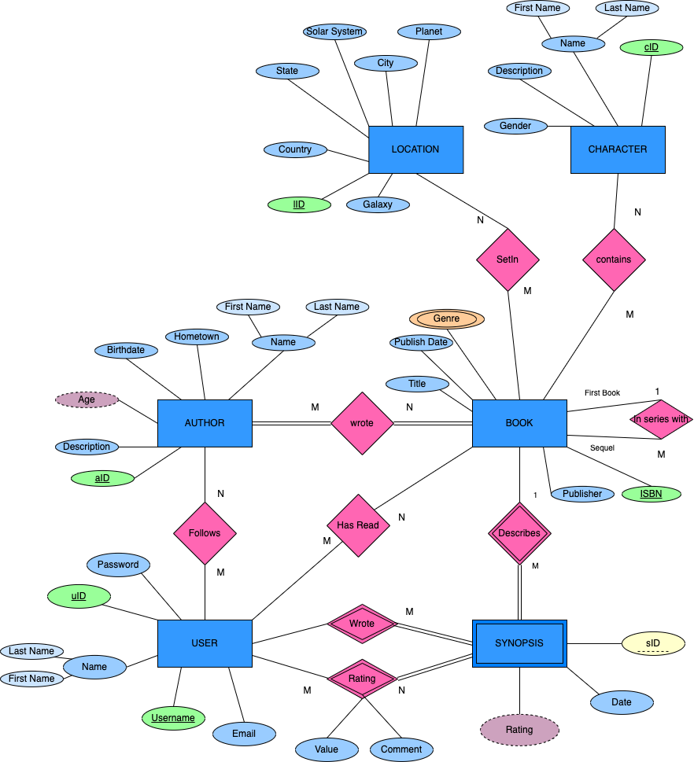

# SynopC ER Model

# Relationships

## User - Synopsis

### Written By
User and Synopsis have a 1:M relationship for written by since one user can write 
many synopsis, but the synopsis has to be written by one user only (For every user, can have many synopsis). 
Single lined as well since the User doesnt have to write a synopsis. 
Since weak entity, it will be <b>total participation</b>.

### Rating
Rating will be derived from all the values the user rated
that synopsis. Its a weak relationship since the rating shouldnt
exist if the user or synopsis doesnt exist anymore

## Author - Book
In order to be an author, need to write a book, and book needs to have
been written by an author. M:M since many books can be written by
Many authors, and many authors can write many books. Double lined as well 
since a book always has an Author or Authors whom wrote it. (M:M will need combination of 
primary keys from each entity for primary key)

## User - Book
M:M for Users have read Book because many users can have read 1
book, and many books can be read by any user. Partial participation
since you dont have to read books and books dont ever have to have been read.
(Is a book really a book if it hasnt been read?)

## Book - Book
Book is 1:M with itself since a book can have a first book in a sequel,
then many sequels to one first book. When making the schema, make sure
to refer to the primary key twice, but only make the Many side have 
the primary key. ( Book(ISBN1, ISBN2) Fkey ISBN1 ref (ISBN), Fkey ISBN2 ref (ISBN))

# Attributes

## Synopsis

### Rating
Rating is derived from the values rated by users in the rated relationship.

### sID
sID is the partial key for the weak entity synopsis (weak entities
always need partial key) since synopsis wont exist without the User (userID or username).

## Author

### Age
Author age is derived from the birthdate.

### Name
Composite attribute from the combination of first and last name

# Terms List

Partial Participation Constraint
: Optional relationship from an entity (single line in ER model)

Total Participation Constraint
: Mandatory relationship of an entity (double lines in an ER Model)

Derived attribute
: derived from calculating another attribute (dashed lined oval in ER model)

Composite Attribute
: Combination of two or more other attributes to create one